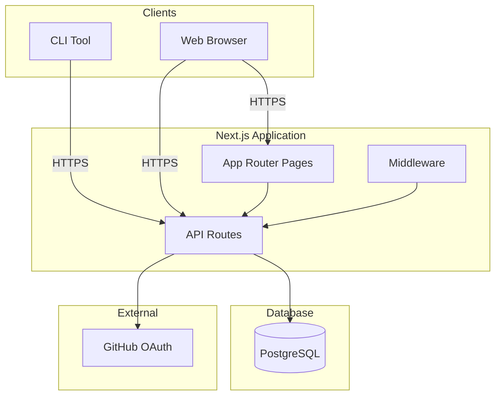
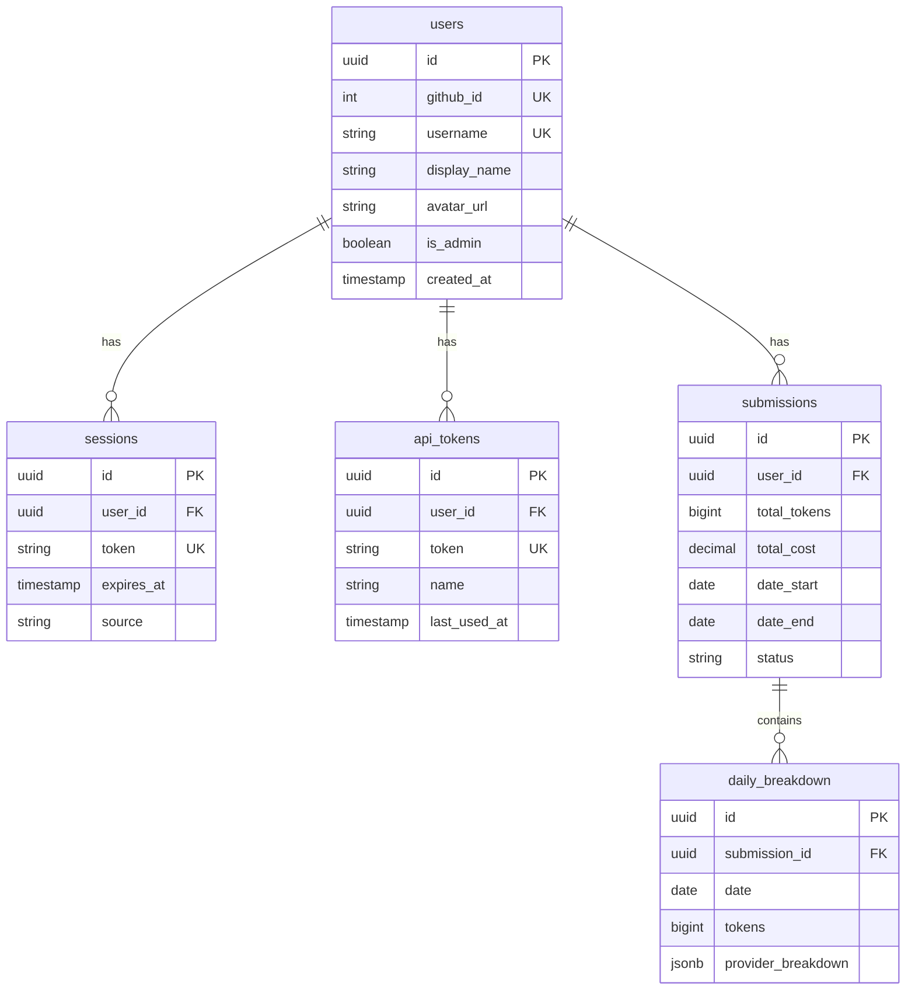

# Original User Request (for reference)
Add social platform features to token-tracker: Users submit data from CLI, view global leaderboard and profile pages (reusing our existing 2D/3D contribution graph instead of usage charts like viberank).

## Additional User Requirements (for reference)
- Use PostgreSQL (generic setup, compatible with Neon/Vercel Postgres/Railway)
- Keep existing custom component style (no shadcn/ui)
- Defer admin features to v2
- Use Vercel subdomain for now (no custom domain)
- Mark parallelizable tasks

# Work Goals
- Set up PostgreSQL database with Drizzle ORM
- Implement custom GitHub OAuth authentication (no NextAuth)
- CLI device flow login and data submission
- Global leaderboard page (/)
- User profile page (/profile/[username]) with existing contribution graph
- Settings page (/settings) for API token management

# Background
token-tracker is currently a local CLI tool that parses OpenCode/Claude Code/Codex/Gemini session data to visualize token usage. We're extending it into a social platform (like viberank) where users can share and compare their usage.

# Execution Started
is_execution_started = TRUE

# All Goals Accomplished
is_all_goals_accomplished = FALSE

# Parallel Execution Requested
parallel_requested = TRUE

# Current Task
- Task 1: Install database and auth dependencies

# Prerequisites

## Reference Design Document
- `docs/SOCIAL_PLATFORM.md` - Comprehensive design with all specifications

## Key Files to Reference

### 1. frontend/src/lib/types.ts
- **Role**: Existing type definitions for contribution data
- **Reference**: `TokenContributionData`, `DailyContribution`, `DataSummary` types
- **Note**: API submission format should align with these existing types

### 2. frontend/src/components/GraphContainer.tsx
- **Role**: Main graph container with 2D/3D toggle
- **Reference**: Props interface, how data is passed
- **Note**: Will be reused on profile pages without modification

### 3. src/cli.ts
- **Role**: Existing CLI entry point
- **Reference**: Command structure using `commander`
- **Note**: New commands (login, logout, whoami, submit) will follow same pattern

### 4. src/native.ts
- **Role**: Native module interface for graph generation
- **Reference**: `generateGraphWithPricing()` function
- **Note**: Submit command will use this to generate data

## Project Commit Message Style
Based on git log analysis:
- `feat(scope): description` - New features
- `fix: description` - Bug fixes
- `docs: description` - Documentation
- `refactor(scope): description` - Code refactoring

# Work Plan

## PRDs & Structures

### System Architecture


### Database Schema


## Implementation Details

### Authentication Flow
1. **Web**: GitHub OAuth -> callback -> create session -> set cookie
2. **CLI**: Request device code -> user enters code in browser -> poll for token -> save locally

### Data Validation (Level 1 only)
- Math validation: `inputTokens + outputTokens == totalTokens`
- No negative values
- No future dates
- Valid date range (start <= end, max 1 year)

# TODOs

## Phase 1: Core Infrastructure

- [ ] 1. Install database and auth dependencies
   - [ ] 1.1 Add to frontend/package.json:
      ```json
      {
        "dependencies": {
          "drizzle-orm": "^0.34.0",
          "@neondatabase/serverless": "^0.9.0",
          "zod": "^3.23.0"
        },
        "devDependencies": {
          "drizzle-kit": "^0.25.0"
        }
      }
      ```
   - [ ] 1.2 Run `cd frontend && yarn install`
   - [ ] 1.3 Commit: `feat(frontend): add database and validation dependencies`
   - [ ] Verification:
      - [ ] `yarn list drizzle-orm` shows installed version
      - [ ] No dependency conflicts in yarn.lock

- [ ] 2. Create Drizzle database schema
   - [ ] 2.1 Create `frontend/src/lib/db/schema.ts` with all tables:
      - users, sessions, api_tokens, device_codes, submissions, daily_breakdown
      - Reference: `docs/SOCIAL_PLATFORM.md` Section 4.3
   - [ ] 2.2 Create `frontend/src/lib/db/index.ts` - Database client
   - [ ] 2.3 Create `frontend/drizzle.config.ts` - Drizzle CLI config
   - [ ] 2.4 Commit: `feat(db): add Drizzle schema for social platform`
   - [ ] Verification:
      - [ ] TypeScript compiles without errors
      - [ ] All 6 tables defined with proper relations

- [ ] 3. Create auth utility functions
   - [ ] 3.1 Create `frontend/src/lib/auth/utils.ts`:
      - `generateRandomString(length)` - Crypto-safe random string
      - `generateUserCode()` - Format: XXXX-XXXX
      - `hashToken(token)` - SHA256 hash for storage
   - [ ] 3.2 Create `frontend/src/lib/auth/session.ts`:
      - `getSession()` - Get current user from cookie
      - `createSession()` - Create new session in DB
      - `setSessionCookie()` - Set httpOnly cookie
      - `clearSession()` - Delete session
      - `validateApiToken()` - Validate CLI token
      - Reference: `docs/SOCIAL_PLATFORM.md` Section 5.4
   - [ ] 3.3 Create `frontend/src/lib/auth/github.ts`:
      - `getAuthorizationUrl(state)` - Build OAuth URL
      - `exchangeCodeForToken(code)` - Exchange code for access token
      - `getGitHubUser(accessToken)` - Fetch user profile
      - Reference: `docs/SOCIAL_PLATFORM.md` Section 5.5
   - [ ] 3.4 Commit: `feat(auth): add session management and GitHub OAuth utilities`
   - [ ] Verification:
      - [ ] TypeScript compiles without errors
      - [ ] All functions have proper types

- [ ] 4. Implement GitHub OAuth API endpoints
   - [ ] 4.1 Create `frontend/src/app/api/auth/github/route.ts`:
      - GET: Generate state, store in cookie, redirect to GitHub
   - [ ] 4.2 Create `frontend/src/app/api/auth/github/callback/route.ts`:
      - GET: Validate state, exchange code, upsert user, create session, redirect
   - [ ] 4.3 Commit: `feat(api): add GitHub OAuth endpoints`
   - [ ] Verification:
      - [ ] Manually test OAuth flow with GitHub app (requires env vars)
      - [ ] Session cookie is set after successful login

- [ ] 5 parallel. Implement session API endpoints
   - **Parallel condition**: Independent of task 5b, different files, no shared state
   - [ ] 5.1 Create `frontend/src/app/api/auth/session/route.ts`:
      - GET: Return current user or null
   - [ ] 5.2 Create `frontend/src/app/api/auth/logout/route.ts`:
      - POST: Clear session cookie and delete from DB
   - [ ] 5.3 Commit: `feat(api): add session and logout endpoints`
   - [ ] Verification:
      - [ ] GET /api/auth/session returns user after login
      - [ ] POST /api/auth/logout clears session

- [ ] 5 parallel. Create Next.js middleware for protected routes
   - **Parallel condition**: Independent of task 5a, different files, no shared state
   - [ ] 5.1 Create `frontend/middleware.ts`:
      - Check for session cookie on /settings routes
      - Redirect to /api/auth/github if not authenticated
      - Reference: `docs/SOCIAL_PLATFORM.md` Appendix B
   - [ ] 5.2 Commit: `feat(middleware): add route protection`
   - [ ] Verification:
      - [ ] Accessing /settings without login redirects to GitHub OAuth
      - [ ] Accessing /settings with valid session works

- [ ] 6. Add environment variable template
   - [ ] 6.1 Create `frontend/.env.example`:
      ```
      DATABASE_URL=postgres://...
      GITHUB_CLIENT_ID=
      GITHUB_CLIENT_SECRET=
      NEXT_PUBLIC_URL=http://localhost:3000
      SESSION_SECRET=
      ```
   - [ ] 6.2 Add `frontend/.env.local` to `.gitignore` if not already
   - [ ] 6.3 Commit: `docs: add environment variable template`
   - [ ] Verification:
      - [ ] .env.example exists with all required variables
      - [ ] .env.local is gitignored

## Phase 2: CLI Integration

- [ ] 7. Implement device flow API endpoints
   - [ ] 7.1 Create `frontend/src/app/api/auth/device/route.ts`:
      - POST: Generate device_code and user_code, store in DB, return codes
   - [ ] 7.2 Create `frontend/src/app/api/auth/device/poll/route.ts`:
      - POST: Check if device_code is authorized, return token if complete
   - [ ] 7.3 Create `frontend/src/app/api/auth/device/authorize/route.ts`:
      - POST: Link user_code to authenticated user
   - [ ] 7.4 Commit: `feat(api): add device flow endpoints for CLI auth`
   - [ ] Verification:
      - [ ] POST /api/auth/device returns deviceCode and userCode
      - [ ] Polling returns "pending" until authorized

- [ ] 8. Create device authorization page
   - [ ] 8.1 Create `frontend/src/app/device/page.tsx`:
      - Show login button if not authenticated
      - Show code input form if authenticated
      - Handle authorization submission
      - Reference: `docs/SOCIAL_PLATFORM.md` Section 8.3
   - [ ] 8.2 Commit: `feat(frontend): add device authorization page`
   - [ ] Verification:
      - [ ] /device page loads correctly
      - [ ] Code input validates format (XXXX-XXXX)
      - [ ] Shows success message after authorization

- [ ] 9. Create CLI credentials module
   - [ ] 9.1 Create `src/credentials.ts`:
      - `loadCredentials()` - Read from ~/.config/token-tracker/credentials.json
      - `saveCredentials()` - Write with 0600 permissions
      - `clearCredentials()` - Delete credentials file
      - Reference: `docs/SOCIAL_PLATFORM.md` Section 7.2
   - [ ] 9.2 Commit: `feat(cli): add credentials storage module`
   - [ ] Verification:
      - [ ] Credentials saved to correct path
      - [ ] File has restrictive permissions (0600)

- [ ] 10. Implement CLI auth commands
   - [ ] 10.1 Create `src/auth.ts`:
      - `login()` - Device flow with browser open, poll for token
      - `logout()` - Clear local credentials
      - `whoami()` - Display current user
      - Reference: `docs/SOCIAL_PLATFORM.md` Section 7.3
   - [ ] 10.2 Add commands to `src/cli.ts`:
      ```typescript
      program.command('login').description('...').action(login);
      program.command('logout').description('...').action(logout);
      program.command('whoami').description('...').action(whoami);
      ```
   - [ ] 10.3 Add `open` package dependency for browser opening
   - [ ] 10.4 Commit: `feat(cli): add login, logout, whoami commands`
   - [ ] Verification:
      - [ ] `token-tracker login` opens browser and polls
      - [ ] `token-tracker whoami` shows logged in user
      - [ ] `token-tracker logout` clears credentials

- [ ] 11. Create submission validation logic
   - [ ] 11.1 Create `frontend/src/lib/validation/submission.ts`:
      - Zod schema for submission data
      - `validateSubmission()` function with Level 1 rules:
        - Math validation (input + output = total)
        - No negative values
        - No future dates
        - Valid date range
      - Reference: `docs/SOCIAL_PLATFORM.md` Section 9.1
   - [ ] 11.2 Commit: `feat(validation): add submission validation with Zod`
   - [ ] Verification:
      - [ ] Invalid data rejected with clear error messages
      - [ ] Valid data passes validation

- [ ] 12. Implement submit API endpoint
   - [ ] 12.1 Create `frontend/src/app/api/submit/route.ts`:
      - POST: Validate API token, validate data, store submission + daily breakdown
      - Return success with profile URL or error details
      - Reference: `docs/SOCIAL_PLATFORM.md` Section 6.2
   - [ ] 12.2 Commit: `feat(api): add submission endpoint`
   - [ ] Verification:
      - [ ] Requires valid API token
      - [ ] Validates submission data
      - [ ] Creates submission and daily_breakdown records

- [ ] 13. Implement CLI submit command
   - [ ] 13.1 Create `src/submit.ts`:
      - Check authentication
      - Generate graph data using existing native module
      - Show preview table
      - Confirm with user
      - POST to /api/submit
      - Reference: `docs/SOCIAL_PLATFORM.md` Section 7.3
   - [ ] 13.2 Add command to `src/cli.ts`:
      ```typescript
      program.command('submit')
        .description('Submit token usage data to platform')
        .option('--dry-run', 'Preview without submitting')
        .action(submit);
      ```
   - [ ] 13.3 Commit: `feat(cli): add submit command`
   - [ ] Verification:
      - [ ] `token-tracker submit --dry-run` shows preview
      - [ ] `token-tracker submit` uploads data successfully
      - [ ] Shows profile URL after successful submission

## Phase 3: Frontend Pages

- [ ] 14. Restructure app directory with route groups
   - [ ] 14.1 Create `frontend/src/app/(main)/layout.tsx`:
      - Navigation header with login/user menu
      - Footer
   - [ ] 14.2 Move current page.tsx logic appropriately
   - [ ] 14.3 Create shared layout structure
   - [ ] 14.4 Commit: `refactor(frontend): restructure app with route groups`
   - [ ] Verification:
      - [ ] Existing functionality still works
      - [ ] Navigation appears on main pages

- [ ] 15. Create shared Navigation component
   - [ ] 15.1 Create `frontend/src/components/Navigation.tsx`:
      - Logo + "Token Tracker" title
      - Navigation links (Leaderboard, if logged in: Profile, Settings)
      - Login button or UserMenu dropdown
      - Theme toggle (reuse existing ThemeToggle)
   - [ ] 15.2 Create `frontend/src/components/UserMenu.tsx`:
      - Avatar + username
      - Dropdown: Profile, Settings, Logout
   - [ ] 15.3 Create `frontend/src/hooks/useSession.ts`:
      - Client-side hook to fetch /api/auth/session
   - [ ] 15.4 Commit: `feat(frontend): add Navigation and UserMenu components`
   - [ ] Verification:
      - [ ] Navigation shows on all main pages
      - [ ] Login button shows when not authenticated
      - [ ] UserMenu shows when authenticated

- [ ] 16 parallel. Create leaderboard API endpoint
   - **Parallel condition**: Independent of profile API, different routes, no shared state
   - [ ] 16.1 Create `frontend/src/app/api/leaderboard/route.ts`:
      - GET: Query submissions aggregated by user
      - Support query params: period, page, limit, sort
      - Return ranked users with stats
      - Reference: `docs/SOCIAL_PLATFORM.md` Section 6.3
   - [ ] 16.2 Commit: `feat(api): add leaderboard endpoint`
   - [ ] Verification:
      - [ ] Returns paginated user list
      - [ ] Sorted by total_tokens descending
      - [ ] Includes global stats

- [ ] 16 parallel. Create user profile API endpoint
   - **Parallel condition**: Independent of leaderboard API, different routes, no shared state
   - [ ] 16.1 Create `frontend/src/app/api/users/[username]/route.ts`:
      - GET: Fetch user profile, stats, contributions
      - Calculate rank, streaks
      - Return data compatible with existing graph components
      - Reference: `docs/SOCIAL_PLATFORM.md` Section 6.4
   - [ ] 16.2 Commit: `feat(api): add user profile endpoint`
   - [ ] Verification:
      - [ ] Returns 404 for unknown users
      - [ ] Contributions format matches TokenContributionData

- [ ] 17. Create leaderboard page components
   - [ ] 17.1 Create `frontend/src/components/leaderboard/HeroStats.tsx`:
      - Display total users, total tokens, total cost
      - Large stat cards with icons
   - [ ] 17.2 Create `frontend/src/components/leaderboard/LeaderboardTable.tsx`:
      - Rank, avatar, username, tokens, cost, active days
      - Highlight current user row
   - [ ] 17.3 Create `frontend/src/components/leaderboard/PeriodSelector.tsx`:
      - All time / This month / This week buttons
   - [ ] 17.4 Commit: `feat(frontend): add leaderboard components`
   - [ ] Verification:
      - [ ] Components render correctly with mock data
      - [ ] Styling matches existing app style

- [ ] 18. Create leaderboard page
   - [ ] 18.1 Create `frontend/src/app/(main)/page.tsx`:
      - Server component fetching /api/leaderboard
      - HeroStats + LeaderboardTable + Pagination
      - ISR with revalidate: 300 (5 minutes)
   - [ ] 18.2 Commit: `feat(frontend): add leaderboard home page`
   - [ ] Verification:
      - [ ] Page loads with leaderboard data
      - [ ] Pagination works
      - [ ] Period selector filters data

- [ ] 19. Create profile page components
   - [ ] 19.1 Create `frontend/src/components/profile/UserHeader.tsx`:
      - Avatar, username, display name, rank badge, joined date
   - [ ] 19.2 Create `frontend/src/components/profile/StatsCards.tsx`:
      - Total tokens, cost, active days, current streak, longest streak
   - [ ] 19.3 Commit: `feat(frontend): add profile components`
   - [ ] Verification:
      - [ ] Components render correctly with mock data

- [ ] 20. Create profile page
   - [ ] 20.1 Create `frontend/src/app/(main)/profile/[username]/page.tsx`:
      - Server component fetching /api/users/[username]
      - UserHeader + StatsCards
      - Reuse existing GraphContainer and BreakdownPanel
      - ISR with revalidate: 60 (1 minute)
   - [ ] 20.2 Handle 404 for unknown users
   - [ ] 20.3 Commit: `feat(frontend): add user profile page`
   - [ ] Verification:
      - [ ] Profile page loads with user data
      - [ ] Graph displays correctly (same as current app)
      - [ ] 404 page for non-existent users

- [ ] 21. Create settings page
   - [ ] 21.1 Create `frontend/src/app/(main)/settings/page.tsx`:
      - Protected route (middleware redirects if not logged in)
      - API tokens section: list, create, revoke
      - Submission history section
   - [ ] 21.2 Create `frontend/src/components/settings/ApiTokenList.tsx`:
      - Table of tokens with name, created date, last used
      - Revoke button for each
   - [ ] 21.3 Create `frontend/src/app/api/tokens/route.ts`:
      - GET: List user's API tokens
      - POST: Create new token
      - DELETE: Revoke token
   - [ ] 21.4 Commit: `feat(frontend): add settings page with API token management`
   - [ ] Verification:
      - [ ] Redirects to login if not authenticated
      - [ ] Can create new API tokens
      - [ ] Can revoke existing tokens

## Phase 4: Polish

- [ ] 22. Add loading states and error boundaries
   - [ ] 22.1 Create loading.tsx files for main routes
   - [ ] 22.2 Create error.tsx files for error handling
   - [ ] 22.3 Add skeleton components for leaderboard and profile
   - [ ] 22.4 Commit: `feat(frontend): add loading states and error boundaries`
   - [ ] Verification:
      - [ ] Loading skeleton shows while data loads
      - [ ] Error page shows on API errors

- [ ] 23. Mobile responsiveness improvements
   - [ ] 23.1 Review and fix leaderboard table on mobile
   - [ ] 23.2 Review and fix profile layout on mobile
   - [ ] 23.3 Review and fix navigation on mobile
   - [ ] 23.4 Commit: `fix(frontend): improve mobile responsiveness`
   - [ ] Verification:
      - [ ] All pages usable on mobile viewport
      - [ ] No horizontal scrolling issues

- [ ] 24. Add ISR caching strategy
   - [ ] 24.1 Configure revalidation times:
      - Leaderboard: 5 minutes
      - Profile: 1 minute
   - [ ] 24.2 Add generateStaticParams for top 100 profiles
   - [ ] 24.3 Commit: `perf(frontend): add ISR caching strategy`
   - [ ] Verification:
      - [ ] Pages are cached and revalidated correctly
      - [ ] Build generates static pages for top users

- [ ] 25. Update documentation
   - [ ] 25.1 Update main README.md with new features:
      - Social platform overview
      - CLI commands: login, logout, whoami, submit
      - Web features: leaderboard, profiles
   - [ ] 25.2 Add CONTRIBUTING.md if needed
   - [ ] 25.3 Commit: `docs: update README with social platform features`
   - [ ] Verification:
      - [ ] README covers all new features
      - [ ] Setup instructions are complete

# Final Verification Checklist
- [ ] 1. Full flow test: CLI login -> submit -> view on leaderboard -> view profile
- [ ] 2. Graph components render correctly on profile pages (same as current local view)
- [ ] 3. All API endpoints have proper error handling
- [ ] 4. Session management works (login persists, logout clears)
- [ ] 5. Validation rejects invalid submissions with clear messages
- [ ] 6. Mobile experience is usable
- [ ] 7. No TypeScript errors in build
- [ ] 8. ESLint passes
